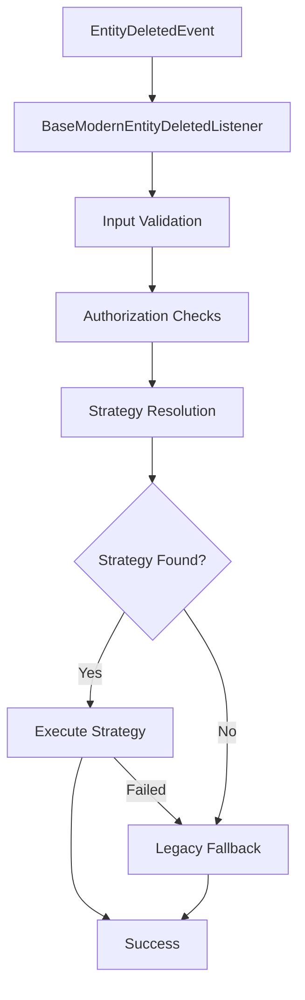

# Modern Entity Deletion System Documentation

## Overview

The Modern Entity Deletion System is a comprehensive, enterprise-grade solution for handling entity deletions across microservices in the Moon Project ecosystem. It implements a strategy pattern with advanced resilience, security, and monitoring capabilities.

## Architecture

### Strategy Pattern Implementation



### Core Components

1. **BaseModernEntityDeletedListener** - Abstract base class with common functionality
2. **EntityDeletionRegistry** - Central registry for deletion strategies
3. **Service-Specific Listeners** - Implementation for each microservice
4. **Strategy Classes** - Business logic for entity deletion

## Features

### 🚀 Performance Features
- **Real-time Monitoring**: Track processing time, throughput, and resource usage
- **Performance Thresholds**: Automatic alerting for slow operations
- **Memory Monitoring**: Heap usage tracking and optimization
- **Throughput Analysis**: Entities processed per second metrics

### 🔒 Security Features
- **Input Validation**: MongoDB ObjectId validation, data sanitization
- **Rate Limiting**: 1 request per second per user per service
- **Authorization Checks**: Service-specific business logic validation
- **Audit Logging**: Comprehensive security event logging
- **Suspicious Activity Detection**: Bulk operation monitoring

### 🛡️ Resilience Features
- **Retry Mechanism**: Exponential backoff for failed operations
- **Strategy Initialization**: Error tracking and automatic retry
- **Graceful Degradation**: Automatic fallback to legacy implementation
- **Transaction Support**: ACID compliance with rollback capabilities

## Service Implementations

### Orders Service
```typescript
class ModernEntityDeletedListener extends BaseModernEntityDeletedListener {
  protected serviceName = 'orders';
  
  // Orders-specific authorization
  protected async performServiceSpecificAuthorization(data, userId, span) {
    // Bulk order deletion detection
    // Business logic validation
  }
}
```

### Products Service
```typescript
class ModernEntityDeletedListener extends BaseModernEntityDeletedListener {
  protected serviceName = 'products';
  
  // CDN cleanup integration
  // Product image deletion handling
}
```

### Pricing Service
```typescript
class ModernEntityDeletedListener extends BaseModernEntityDeletedListener {
  protected serviceName = 'pricing';
  
  // Financial audit trail preservation
  // Price history compliance checks
}
```

## Performance Metrics

### Key Performance Indicators

| Metric | Threshold | Description |
|--------|-----------|-------------|
| Total Processing Time | < 5000ms | End-to-end event processing |
| Validation Duration | < 1000ms | Input validation and sanitization |
| Authorization Duration | < 500ms | Security and authorization checks |
| Throughput | > 10 entities/sec | Processing rate for bulk operations |
| Success Rate | > 99% | Successful deletion percentage |

### Real-time Monitoring

```typescript
// Get current performance statistics
const stats = listener.getPerformanceStats();
console.log({
  totalEvents: stats.totalEvents,
  averageDuration: stats.averageDurationMs,
  throughput: stats.averageEntitiesPerSecond,
  successRate: stats.successRate
});
```

## Security Implementation

### Input Validation Pipeline

1. **Structure Validation**: Event data format verification
2. **Entity Validation**: MongoDB ObjectId format checking
3. **Sanitization**: Removal of harmful characters
4. **Business Logic**: Service-specific validation rules

### Authorization Flow

```typescript
// Example authorization check
protected async performServiceSpecificAuthorization(data, userId, span) {
  // Check user permissions
  // Validate business rules
  // Log security decisions
  // Apply rate limiting
}
```

## Configuration

### Environment Variables

```bash
# Transaction support
USE_TRANSACTIONS=true

# Service configuration
NODE_ENV=production
LOG_LEVEL=info

# Security settings (optional)
RATE_LIMIT_ENABLED=true
MAX_BULK_OPERATIONS=100
```

### Feature Flags

| Feature | Default | Description |
|---------|---------|-------------|
| Strategy Pattern | ✅ Enabled | Dynamic strategy resolution |
| Transaction Support | ✅ Enabled | ACID compliance |
| Legacy Fallback | ✅ Enabled | Backward compatibility |
| Performance Monitoring | ✅ Enabled | Real-time metrics |
| Security Validation | ✅ Enabled | Input/authorization checks |
| Rate Limiting | ✅ Enabled | DOS protection |

## API Reference

### Core Methods

#### `processEvent(data: EntityDeletedEvent['data']): Promise<void>`
Main entry point for entity deletion events.

**Flow:**
1. Input validation and sanitization
2. Authorization checks
3. Strategy pattern execution
4. Performance monitoring
5. Error handling and logging

#### `getHealthStatus(): HealthStatus`
Returns current system health including strategy registry status.

```typescript
interface HealthStatus {
  strategiesRegistered: number;
  transactionSupported: boolean;
  fallbackAvailable: boolean;
  supportedEntities: string[];
}
```

#### `getPerformanceStats(): PerformanceStats`
Returns comprehensive performance metrics.

```typescript
interface PerformanceStats {
  totalEvents: number;
  averageDurationMs: number;
  averageEntitiesPerSecond: number;
  successRate: number;
  memoryUsage: MemoryUsage;
}
```

#### `getResilienceStatus(): ResilienceStatus`
Returns resilience information including initialization errors.

## Migration Guide

### From Legacy to Modern System

1. **Phase 1**: Deploy modern listeners alongside legacy
2. **Phase 2**: Enable strategy pattern with `USE_MODERN_ENTITY_DELETION=true`
3. **Phase 3**: Monitor performance and error rates
4. **Phase 4**: Deprecate legacy implementation

### Rollback Strategy

If issues occur, disable modern system:
```bash
USE_MODERN_ENTITY_DELETION=false
```

System automatically falls back to legacy implementation.

## Troubleshooting

### Common Issues

#### Slow Performance
```typescript
// Check performance stats
const stats = listener.getPerformanceStats();
if (stats.averageDurationMs > 5000) {
  // Investigation needed
  console.log('Performance issue detected');
}
```

#### Strategy Initialization Errors
```typescript
// Check resilience status
const resilience = listener.getResilienceStatus();
if (resilience.initializationStatus.totalErrors > 0) {
  // Review strategy registration
  console.log('Strategy errors:', resilience.initializationStatus.errorsByEntity);
}
```

#### Rate Limiting Issues
Check logs for rate limiting warnings:
```
WARN: Rate limit exceeded: too many deletion requests
```

## Monitoring and Alerting

### Key Metrics to Monitor

1. **Performance Metrics**
   - Average processing time
   - Throughput (entities/sec)
   - Error rates

2. **Security Metrics**
   - Rate limiting events
   - Validation failures
   - Suspicious activity

3. **Resilience Metrics**
   - Strategy initialization errors
   - Fallback usage rates
   - Recovery times

### Recommended Alerts

- Processing time > 5 seconds
- Error rate > 1%
- Rate limiting > 10 events/minute
- Strategy initialization failures

## Best Practices

### Development

1. **Always implement service-specific authorization**
2. **Use proper error handling and logging**
3. **Test both strategy and fallback paths**
4. **Monitor performance in production**

### Operations

1. **Monitor key performance indicators**
2. **Set up appropriate alerting**
3. **Regular performance review**
4. **Capacity planning based on metrics**

### Security

1. **Validate all inputs thoroughly**
2. **Implement proper authorization logic**
3. **Monitor for suspicious activity**
4. **Regular security audits**

## Support

For issues and questions:
- Review logs for detailed error information
- Check performance and resilience status
- Consult troubleshooting guide
- Contact development team

---

*Last updated: ${new Date().toISOString()}*
*Version: 2.0.0*
*System: Moon Project Modern Entity Deletion*